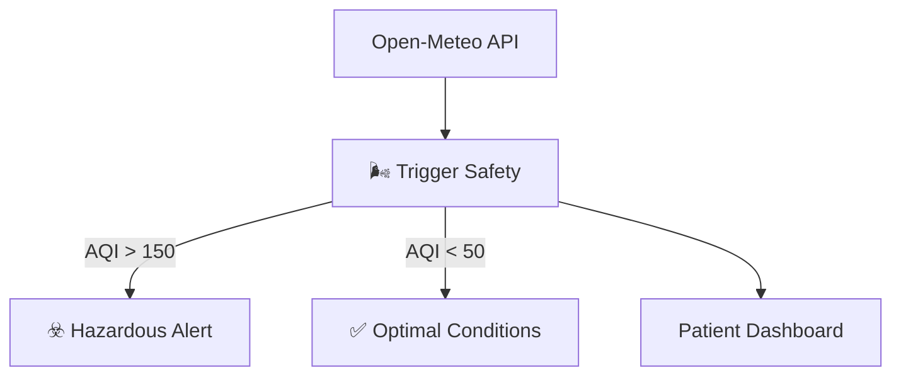

<div align="center">

</div>

## 🏗️ Architecture
The **BreathEasy System** uses a Trigger Safety Guardrail to deterministic flag hazardous environmental conditions.



## 🧪 Testing
Run deterministic safety tests with:
```bash
npm test
```

# Run and deploy your AI Studio app

This contains everything you need to run your app locally.

View your app in AI Studio: https://ai.studio/apps/drive/1kS4iKUFo-Y7xNl7i-RJf-cRYNIB8uRmC

## Run Locally

**Prerequisites:**  Node.js


1. Install dependencies:
   `npm install`
2. Set the `GEMINI_API_KEY` in [.env.local](.env.local) to your Gemini API key
3. Run the app:
   `npm run dev`
